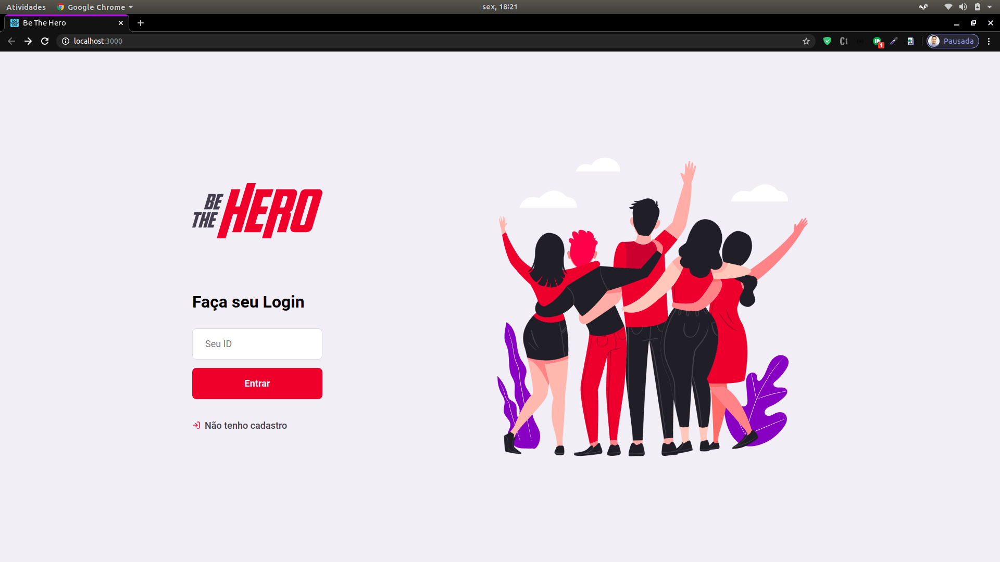
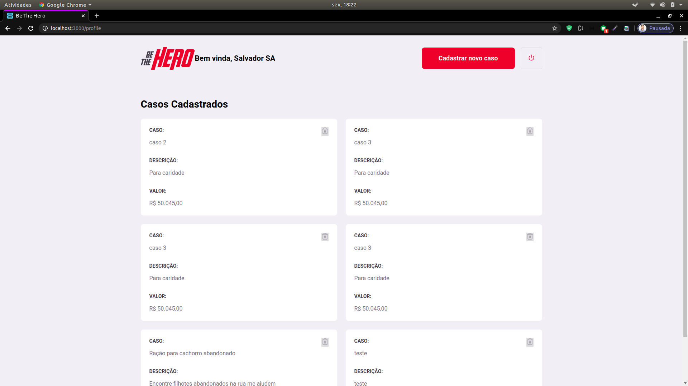
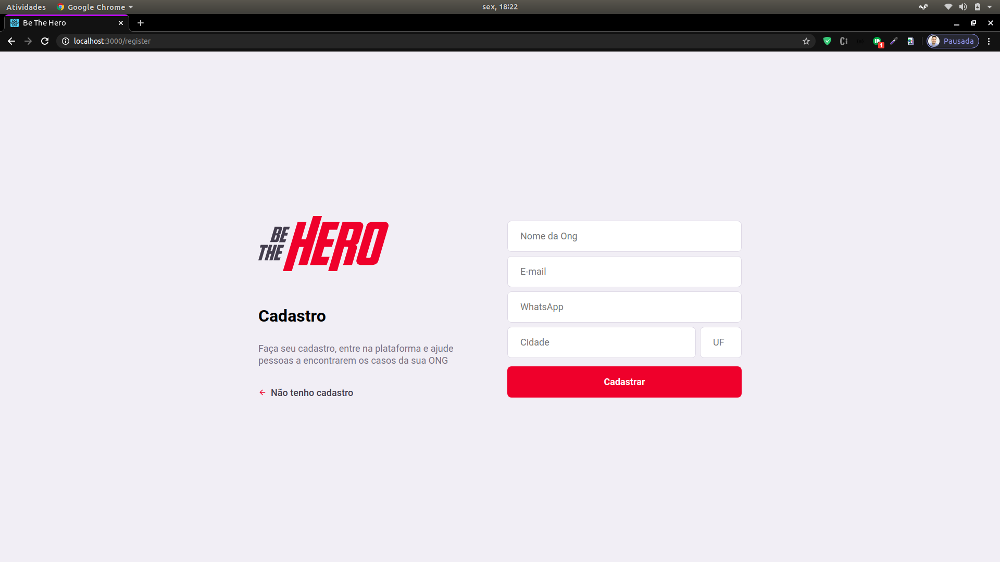
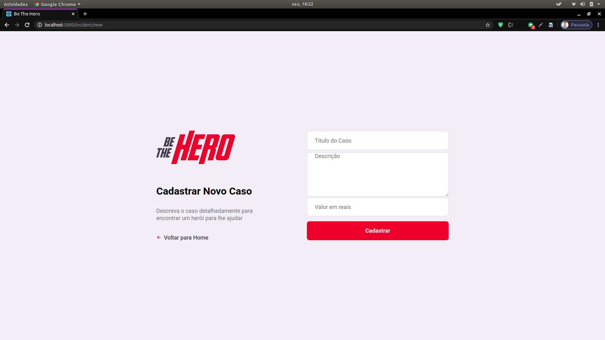
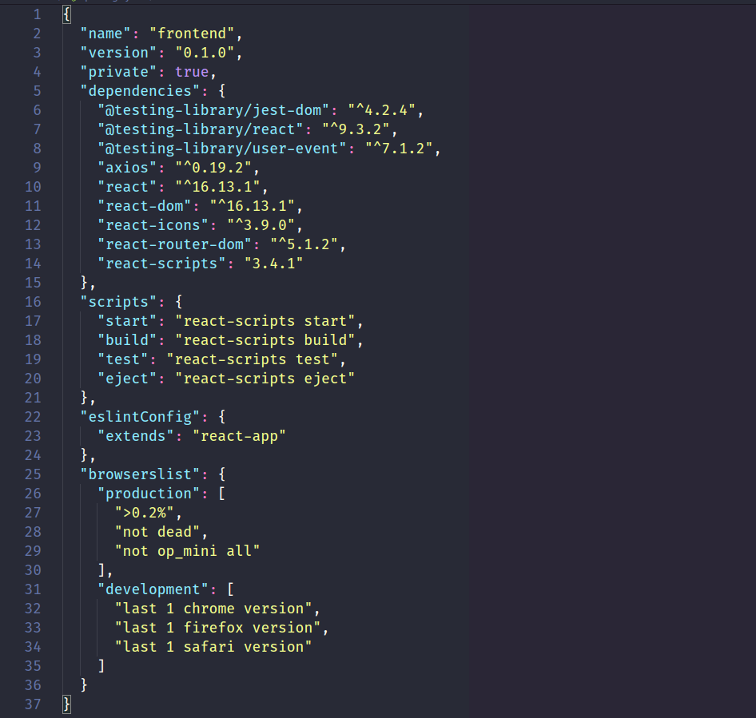

<h2 class="code-line" data-line-start=0 data-line-end=1 >Be The Hero</h2>
<h3 class="code-line" data-line-start=2 data-line-end=3 >Objective:</h3>
<h4 class="code-line" data-line-start=3 data-line-end=4 >Application developed for donation incidents management, being able to register, edit, disable and list incidents.</h4>
<h3 class="code-line" data-line-start=5 data-line-end=6 >Main Technologies:</h3>
<ul>
<li class="has-line-data" data-line-start="6" data-line-end="7">REACTJS</li>
<li class="has-line-data" data-line-start="7" data-line-end="8">JAVASCRIPT</li>
<li class="has-line-data" data-line-start="8" data-line-end="10">CSS3</li>
<li class="has-line-data" data-line-start="8" data-line-end="10">HTML5</li>

</ul>
<h3 class="code-line" data-line-start=10 data-line-end=11 >Minimum prerequisites:</h3>
<ul>
<li class="has-line-data" data-line-start="11" data-line-end="12">NODE 10</li>
</ul>
<h3 class="code-line" data-line-start=12 data-line-end=13 >Running Application:</h3>
<ul>
<li class="has-line-data" data-line-start="13" data-line-end="14">Clone this project</li>
<li class="has-line-data" data-line-start="14" data-line-end="15">Run the project using the command below.</li>
</ul>
<pre><code class="has-line-data" data-line-start="16" data-line-end="19" class="language-sh">$ npm install
$ npm start
</code></pre>
<h3 class="code-line" data-line-start=20 data-line-end=21 >Testing Application:</h3>

<a href="http://localhost:3000/#/">http://localhost:3000/#/</a>

<h3 class="code-line" data-line-start=23 data-line-end=24 >Project Dependencies:</h3>

<h3 class="code-line" data-line-start=62 data-line-end=63 >Note:</h3>

This application is just the frontend, if you want backend go to

<a href="https://github.com/ThiagoSalvadorFloripa/ongsApiRest-NODEJS-EXPRESS-SQLITE-KNEX">ACCESS BACKEND!</a>

<h3 class="code-line" data-line-start=64 data-line-end=65 >Version:</h3>

1.0.0

<h3 class="code-line" data-line-start=66 data-line-end=67 >Author:</h3>

Thiago Salvador 

<a href="https://www.linkedin.com/in/thiagocostasalvador/">ACCESS!</a>

<h3 class="code-line" data-line-start=70 data-line-end=71 >License:</h3>

The content of this project, itself, is licensed under the MIT license and intellectual property of the author

